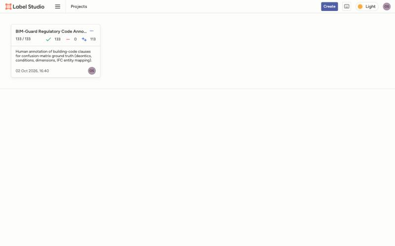
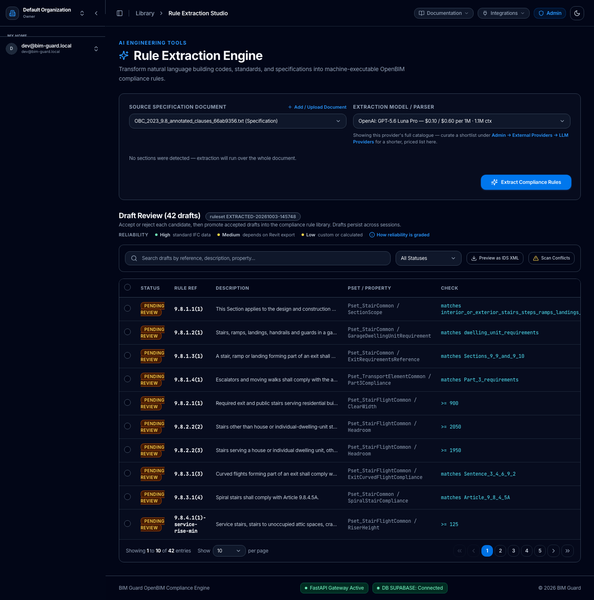

# 1. Purpose

This report documents, with screenshots from the live Label Studio instance, how the human gold
set for rule-extraction evaluation was built: the annotation interface, the tasks, what the
annotator saw and produced, and how those annotations feed the confusion-matrix scoring of
BIM-Guard. All screenshots were captured on 3 October 2026 from the project's own Label Studio
instance (`localhost:8080`, project 1, *BIM-Guard Regulatory Code Annotation*).

**Scope.** Ontario Building Code 2023, Volume 1, Part 9, Section 9.8 (stairs, ramps, handrails and
guards). Dimensional (checkable) rules only.

# 2. Annotation set-up

| Item | Value |
|---|---|
| Tool | Label Studio (`heartexlabs/label-studio`, Docker; `research/label_studio/docker-compose.yml`) |
| Source text | OBC 2023 Vol. 1 Part 9, converted to DocLang; §9.8 sentences loaded as tasks by the `doclang-to-labelstudio` skill |
| Tasks | 133 (one per sentence or table), all with a submitted annotation |
| Pre-annotation | 113 tasks carry a machine prediction (`bim-guard nlp-v1`) that the annotator reviewed and edited |
| Annotator | One annotator account; no second annotator, no adjudication |
| Labeling interface | `research/label_studio/config.xml` — five parts, below |

**Labeling interface.** Each task shows the clause reference and text, then asks for:

1. **Linguistic spans** (12 labels): deontic modality (`MANDATORY`, `PROHIBITED`, `RECOMMENDED`,
   `PERMITTED`), conditions (`APPLICABILITY`, `EXCEPTION`, `QUALIFICATION`), dimensions (`DIM_MIN`,
   `DIM_MAX`, `DIM_EXACT`, `DIM_RANGE`) and `CROSS_REF`.
2. **IFC target entity class** (e.g. `IfcStairFlight`, `IfcRailing`, `IfcRampFlight`).
3. **Target property** (e.g. `RiserHeight`, `TreadLength`, `ClearWidth`, `HandrailHeight`).
4. **Target unit** (`mm`, `m`, `degrees`, `kN`, …).
5. **Per-dimension property** (an optional override, so one clause can constrain several properties).

# 3. Screenshots

## 3.1 Project overview

{width=85%}

## 3.2 Data Manager

{width=85%}

## 3.3 Labeling a clause

{width=75%}

{width=75%}

## 3.4 Labeling interface configuration

{width=85%}

# 4. Annotation statistics

Computed from the Label Studio export `project1_human_2026-10-03.json` (133 tasks, 133 annotations).

| Span label | Count | | Span label | Count |
|---|---:|---|---|---:|
| `APPLICABILITY` | 126 | | `DIM_MAX` | 40 |
| `MANDATORY` | 102 | | `PERMITTED` | 14 |
| `CROSS_REF` | 91 | | `QUALIFICATION` | 8 |
| `DIM_MIN` | 77 | | `PROHIBITED` | 2 |
| `EXCEPTION` | 49 | | `DIM_RANGE` | 1 |
| | | | **Total span regions** | **510** |

| IFC target entity | Annotations |
|---|---:|
| `IfcStairFlight` | 54 |
| `IfcRailing` | 39 |
| `IfcSlab` | 16 |
| `IfcRampFlight` | 7 |
| `IfcWindow` | 5 |
| `IfcCovering` | 4 |
| `IfcDoor` | 2 |
| `Other` | 2 |
| `IfcWall` | 1 |

# 5. From annotation to scored evidence

The export is converted by `eval/label_studio_bridge.py` into gold rules (clause reference, IFC target,
property, operator, value). The current gold set has **129 live clauses and 116 gold rules** (four
fragment tasks are flagged superseded and excluded).

BIM-Guard extraction was then run through its real web interface (Figure 6) with a Playwright
script (`eval/e2e/extraction_confusion_e2e.py`), so the scored drafts are exactly what a reviewer
sees, and scored by `eval/score_extraction_vs_human.py`.

{width=85%}

{width=95%}

**Run 4 results** (`eval/results/e2e/run4_corrected_gold/confusion.md`; model `openai/gpt-5.6-luna-pro`):

| Level | TP | FP | FN | TN | Precision | Recall | F1 |
|---|---:|---:|---:|---:|---:|---:|---:|
| Clause-level | 11 | 1 | 48 | 69 | 91.7% | 18.6% | 31.0% |
| Rule-level, lenient | 22 | 4 | 94 | n/a | 84.6% | 19.0% | 31.0% |
| Rule-level, normalized | 10 | 18 | 106 | n/a | 35.7% | 8.6% | 13.9% |
| Rule-level, strict | 9 | 19 | 107 | n/a | 32.1% | 7.8% | 12.5% |

Run 4 is one of four runs and must not be quoted alone. Runs 1–3 were scored on an earlier gold
revision (89 rules, 117 clauses) with lenient F1 of 77.6%, 34.5% and 27.3%; the two gold versions
are not comparable. Runs 2–4 produced drafts for only part of §9.8 because the whole pasted text
reaches the model as one chunk, so recall reflects run-to-run coverage more than per-clause
accuracy. See `eval/results/e2e/README.md` and `research/CLAIMS.md` §3a.

# 6. Limitations and disclosures

- **Single annotator, no adjudication, no inter-annotator agreement.** The IAA figures produced by
  `eval/score_iaa.py` use simulated inputs and are not evidence.
- **Machine pre-annotation.** Tasks were pre-annotated by `nlp-v1` and then reviewed and edited by
  the annotator, as Figure 3 shows.
- **Gold revisions.** The gold set was revised twice (2 and 3 October). Revision 1 followed a
  config change after run 1; revision 2 fixed sentences the section extractor had dropped, and
  part of it (the 15 cells of Table 9.8.4.1) was labelled after BIM-Guard was seen extracting them.
  Both are disclosed in `research/CLAIMS.md` §3a.
- **Scope.** Dimensional rules only; Table 9.8.7.1 handrail counts remain unlabelled.
- **Not public.** The gold files and clause text are not redistributed, owing to the licensing of
  the OBC text (`docs/DATA_LICENSING.md`), so the scoring cannot be reproduced from the repository
  alone. The screenshots above show short excerpts only.
