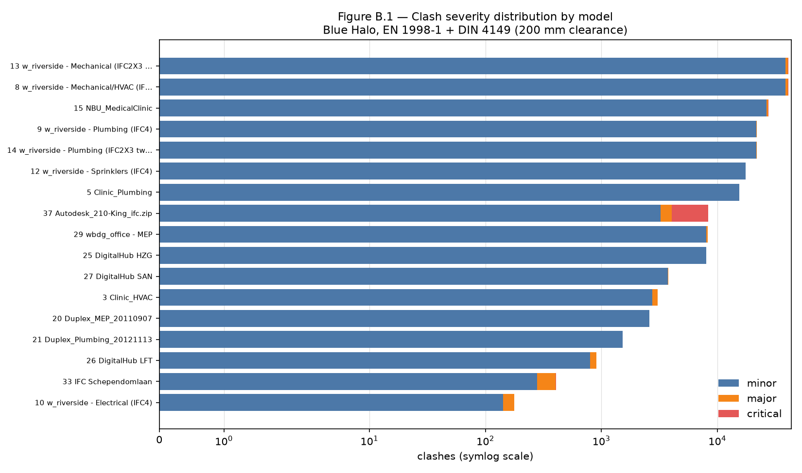
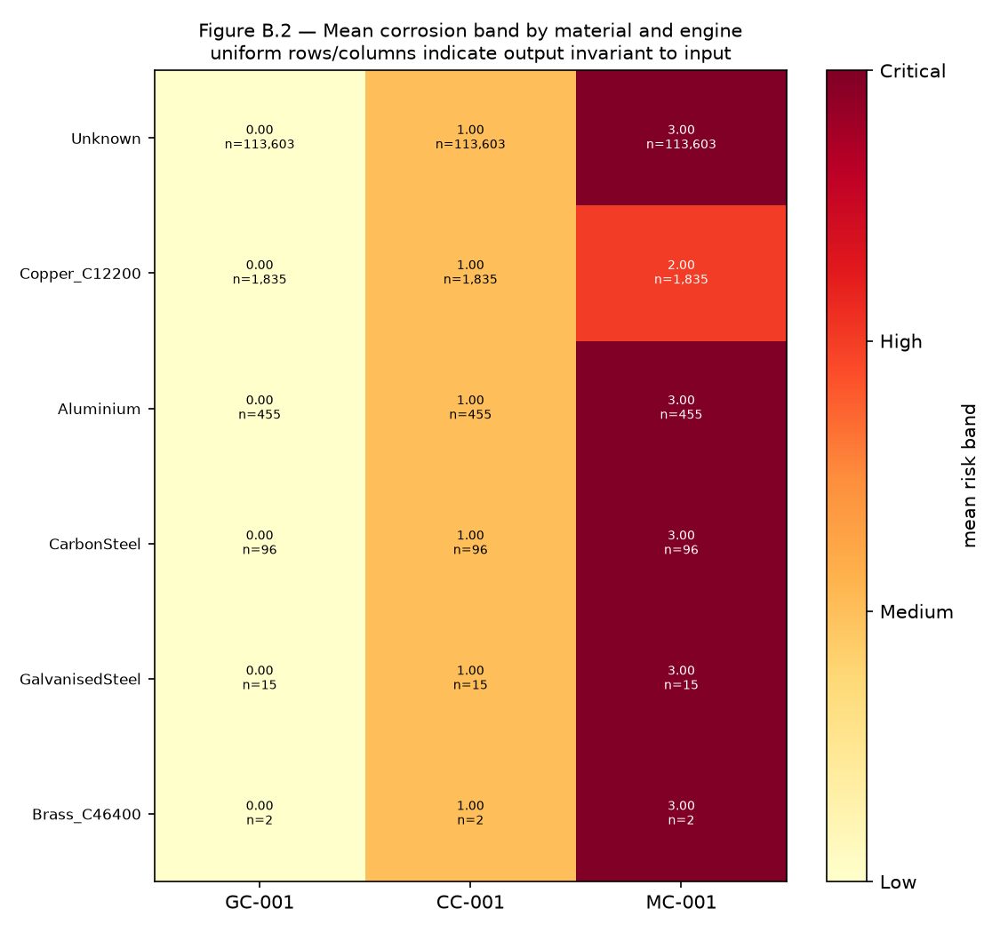
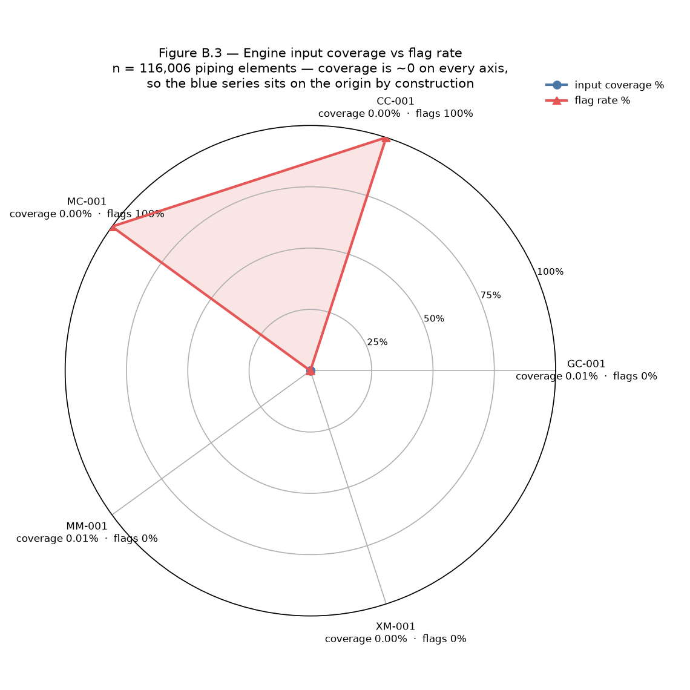
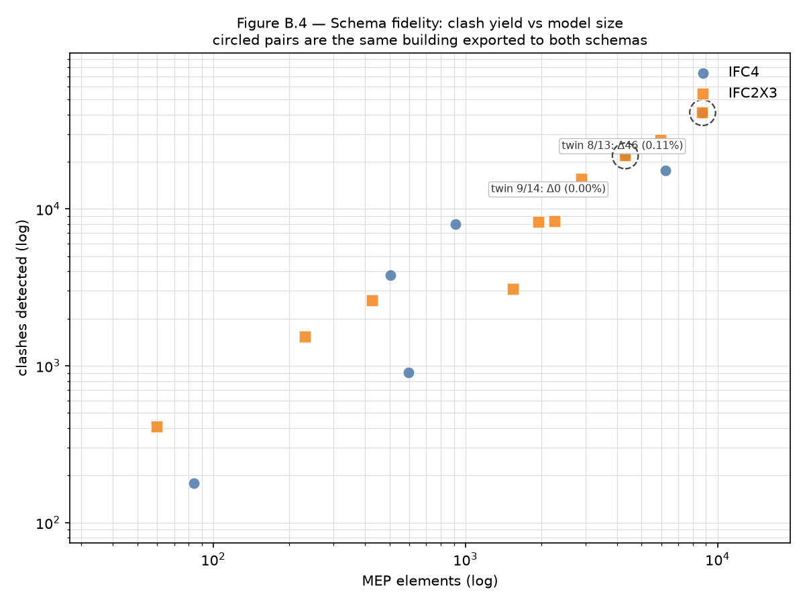

# Appendix B — 38-Model Validation Dataset: Live Results

Generated by `analyse_validation_results.py` from the sweep executed by
`test_all_38_models.py`. Every figure in this appendix is computed from that run;
no value is transcribed by hand.

## B.0 Run provenance

- Models attempted: **38**; processed: **37**; failed: **1**
- MEP elements: **49,736**, of which **49,736** (100.0%) resolved geometry
- Halo volumes generated: **49,736**
- Clashes detected: **223,516**
- Piping elements: **116,006**, of which **38,012** (32.8%) carry raw material text
- Of those, only **2,403** (2.07%) normalise to a `CANONICAL_MATERIALS` key the engines can score — see §B.1.1
- BCF 2.1 archives: **37 valid of 37 readable models** (every archive parsed, every topic folder complete, zero malformed XML). The remaining 1 of 38 is absent rather than invalid — a model that could not be read produces no archive.
- Clearance: EN 1998-1:2020 + DIN 4149:2022, angle_fire, 200 mm

### Failures

- Row 35 — SGD_BODO_ifc.zip (ARC+PLB+VENT): `SchemaError: Unsupported schema: IFC2X2_FINAL`

## B.1 Headline finding

The spatial engine and the corrosion engines behave in opposite ways against
third-party models, and the corpus separates them cleanly.

**Blue Halo generalises.** Geometry resolved for 49,736 of 49,736 MEP elements (100.0%)
across IFC2x3 and IFC4 alike, producing 49,736 halo volumes and 223,516 clashes,
with all 37 BCF archives valid. The same-building schema twins
(Table B.7b) differ by 0.11% and 0.00%, so the result does not depend on the export schema.

**The corrosion engines do not.** Table B.4 shows every engine either flags nothing
(GC-001: 0%) or flags everything (CC-001 and MC-001: 100%), and Table B.3 shows why:
across six distinct materials the mean band is constant — GC-001 returns Low for every
material, CC-001 Medium for every material, and MC-001 Critical for all but one. These
are constant functions of their input, not risk assessments.

The cause is input availability, not engine logic. The best-covered engine is
MM-001, whose required inputs are present on 15 of
116,006 elements (0.013%); the rest are at zero. A 100% flag rate
and 0% input coverage are the same fact viewed twice: the coercers substitute a default
material when none is present, so the engines score the default, uniformly, everywhere.

This is precisely the question §13 puts to this dataset — whether the inputs the
engines need exist in real federated models at all. On this corpus the answer is no.

### B.1.1 Material text is not material data

38,012 elements (32.8%) carry some material
string, but only 2,403 (2.07%) normalise to a
`CANONICAL_MATERIALS` key. The gap — 35,609 elements — is material text that
`piping_producer.normalise_material` cannot map, so the engines still receive
"Unknown". Reporting the former as coverage overstates usable material data by
roughly 16x
and is the single easiest way to misread this corpus.

## Table B.1 — Per-model summary

| row | category | model | schema | size_mb | mep | mep_geom | structural | struct_geom | halos | clashes | minor | major | critical | piping | with_material | bcf_valid | seconds | status |
|---|---|---|---|---|---|---|---|---|---|---|---|---|---|---|---|---|---|---|
| 1 | hospital | Clinic_Architectural.ifc | IFC2X3 | 13.0 | 0 | 0 | 1617 | 1617 | 0 | 0 | 0 | 0 | 0 | 102 | 102 | VALID | 5.0 | ok |
| 2 | hospital | Clinic_Structural.ifc | IFC2X3 | 19.06 | 0 | 0 | 1068 | 1068 | 0 | 0 | 0 | 0 | 0 | 0 | 0 | VALID | 22.7 | ok |
| 3 | hospital | Clinic_HVAC.ifc | IFC2X3 | 26.91 | 1548 | 1548 | 0 | 0 | 1548 | 3070 | 2760 | 308 | 2 | 3704 | 502 | VALID | 50.6 | ok |
| 4 | hospital | Clinic_Electrical.ifc | IFC2X3 | 6.8 | 0 | 0 | 0 | 0 | 0 | 0 | 0 | 0 | 0 | 2089 | 2089 | VALID | 26.3 | ok |
| 5 | hospital | Clinic_Plumbing.ifc | IFC2X3 | 55.83 | 2893 | 2893 | 0 | 0 | 2893 | 15534 | 15479 | 55 | 0 | 6587 | 6587 | VALID | 116.7 | ok |
| 6 | hospital | west_riverside_hospital — Architecture (IFC4 | IFC4 | 80.94 | 0 | 0 | 8935 | 8935 | 0 | 0 | 0 | 0 | 0 | 0 | 0 | VALID | 60.8 | ok |
| 7 | hospital | west_riverside_hospital — Structural (IFC4) | IFC4 | 6.48 | 0 | 0 | 2822 | 2822 | 0 | 0 | 0 | 0 | 0 | 0 | 0 | VALID | 25.6 | ok |
| 8 | hospital | west_riverside_hospital — Mechanical/HVAC (I | IFC4 | 73.05 | 8732 | 8732 | 0 | 0 | 8732 | 41128 | 38705 | 1978 | 445 | 17424 | 0 | VALID | 265.1 | ok |
| 9 | hospital | west_riverside_hospital — Plumbing (IFC4) | IFC4 | 23.76 | 4308 | 4308 | 0 | 0 | 4308 | 21800 | 21702 | 98 | 0 | 8539 | 0 | VALID | 104.8 | ok |
| 10 | hospital | west_riverside_hospital — Electrical (IFC4) | IFC4 | 4.44 | 84 | 84 | 0 | 0 | 84 | 178 | 142 | 36 | 0 | 1673 | 121 | VALID | 13.9 | ok |
| 11 | hospital | west_riverside_hospital — Fire Alarm (IFC4) | IFC4 | 0.91 | 0 | 0 | 0 | 0 | 0 | 0 | 0 | 0 | 0 | 861 | 1 | VALID | 4.3 | ok |
| 12 | hospital | west_riverside_hospital — Sprinklers (IFC4) | IFC4 | 33.99 | 6228 | 6228 | 0 | 0 | 6228 | 17538 | 17494 | 44 | 0 | 13490 | 1302 | VALID | 124.0 | ok |
| 13 | hospital | west_riverside_hospital — Mechanical (IFC2X3 | IFC2X3 | 78.76 | 8732 | 8732 | 0 | 0 | 8732 | 41174 | 38751 | 1978 | 445 | 18488 | 0 | VALID | 249.5 | ok |
| 14 | hospital | west_riverside_hospital — Plumbing (IFC2X3 t | IFC2X3 | 25.0 | 4308 | 4308 | 0 | 0 | 4308 | 21800 | 21702 | 98 | 0 | 9013 | 334 | VALID | 109.7 | ok |
| 15 | hospital | NBU_MedicalClinic (zip: ARC+MEP+HVAC+ELE+STR | IFC2X3 | 207.34 | 5952 | 5952 | 0 | 0 | 5952 | 27472 | 26595 | 846 | 31 | 16012 | 16008 | VALID | 632.6 | ok |
| 16 | hospital | GVA Sanitario.ifc | IFC2X3 | 6.96 | 0 | 0 | 664 | 664 | 0 | 0 | 0 | 0 | 0 | 0 | 0 | VALID | 5.9 | ok |
| 18 | office | Duplex_A_20110907.ifc | IFC2X3 | 2.38 | 0 | 0 | 97 | 97 | 0 | 0 | 0 | 0 | 0 | 0 | 0 | VALID | 2.0 | ok |
| 19 | office | Duplex_Electrical_20121207.ifc | IFC2X3 | 1.6 | 0 | 0 | 0 | 0 | 0 | 0 | 0 | 0 | 0 | 99 | 99 | VALID | 2.1 | ok |
| 20 | office | Duplex_MEP_20110907.ifc | IFC2X3 | 17.87 | 427 | 427 | 0 | 0 | 427 | 2590 | 2590 | 0 | 0 | 926 | 926 | VALID | 22.8 | ok |
| 21 | office | Duplex_Plumbing_20121113.ifc | IFC2X3 | 31.56 | 231 | 231 | 0 | 0 | 231 | 1528 | 1528 | 0 | 0 | 498 | 498 | VALID | 20.2 | ok |
| 22 | office | AC20-Institute-Var-2.ifc | IFC4 | 10.93 | 0 | 0 | 149 | 149 | 0 | 0 | 0 | 0 | 0 | 0 | 0 | VALID | 10.1 | ok |
| 23 | office | AC20-FZK-Haus.ifc | IFC4 | 2.57 | 0 | 0 | 63 | 63 | 0 | 0 | 0 | 0 | 0 | 0 | 0 | VALID | 6.0 | ok |
| 24 | office | DigitalHub_FM-ARC_v2.ifc | IFC4 | 9.02 | 0 | 0 | 357 | 357 | 0 | 0 | 0 | 0 | 0 | 0 | 0 | VALID | 12.1 | ok |
| 25 | office | DigitalHub_FM-HZG_v2.ifc | IFC4 | 20.89 | 914 | 914 | 0 | 0 | 914 | 8000 | 8000 | 0 | 0 | 1795 | 881 | VALID | 49.3 | ok |
| 26 | office | DigitalHub_FM-LFT_v2.ifc | IFC4 | 12.74 | 595 | 595 | 0 | 0 | 595 | 906 | 797 | 109 | 0 | 1310 | 1310 | VALID | 22.9 | ok |
| 27 | office | DigitalHub_FM-SAN_v2.ifc | IFC4 | 25.18 | 504 | 504 | 0 | 0 | 504 | 3784 | 3756 | 28 | 0 | 1010 | 506 | VALID | 31.1 | ok |
| 28 | office | wbdg_office — Architecture | IFC2X3 | 4.1 | 0 | 0 | 497 | 497 | 0 | 0 | 0 | 0 | 0 | 31 | 31 | VALID | 4.8 | ok |
| 29 | office | wbdg_office — MEP | IFC2X3 | 41.89 | 1959 | 1959 | 0 | 0 | 1959 | 8256 | 8047 | 202 | 7 | 5697 | 5697 | VALID | 162.1 | ok |
| 30 | office | wbdg_office — Structural | IFC2X3 | 11.07 | 0 | 0 | 495 | 495 | 0 | 0 | 0 | 0 | 0 | 0 | 0 | VALID | 24.8 | ok |
| 31 | office | Molio_with_URIs.ifc | IFC2X3 | 73.95 | 0 | 0 | 267 | 160 | 0 | 0 | 0 | 0 | 0 | 48 | 0 | VALID | 28.6 | ok |
| 32 | office | GVA Administrativo.ifc | IFC2X3 | 7.21 | 0 | 0 | 338 | 338 | 0 | 0 | 0 | 0 | 0 | 0 | 0 | VALID | 5.0 | ok |
| 33 | office | IFC Schependomlaan.ifc | IFC2X3 | 49.29 | 60 | 60 | 1419 | 1364 | 60 | 407 | 279 | 124 | 4 | 73 | 73 | VALID | 25.5 | ok |
| 34 | industrial | craslabbim.ifc | IFC2X3 | 67.55 | 0 | 0 | 76 | 76 | 0 | 0 | 0 | 0 | 0 | 0 | 0 | VALID | 27.1 | ok |
| 35 | industrial | SGD_BODO_ifc.zip (ARC+PLB+VENT) | - | 0 | 0 | 0 | 0 | 0 | 0 | 0 | 0 | 0 | 0 | 0 | 0 | missing | 0 | error |
| 36 | industrial | Academic_Autodesk_ifc.zip (Basic + Advanced) | IFC2X3 | 38.07 | 0 | 0 | 3649 | 3649 | 0 | 0 | 0 | 0 | 0 | 41 | 41 | VALID | 31.6 | ok |
| 37 | industrial | Autodesk_210-King_ifc.zip | IFC2X3 | 155.15 | 2261 | 2261 | 4283 | 4283 | 2261 | 8351 | 3254 | 795 | 4302 | 6496 | 904 | VALID | 1286.9 | ok |
| 38 | industrial | aisc_sculpture_brep.ifc | IFC2X3 | 0.55 | 0 | 0 | 87 | 87 | 0 | 0 | 0 | 0 | 0 | 0 | 0 | VALID | 0.7 | ok |
| 39 | industrial | aisc_sculpture_param.ifc | IFC2X3 | 0.32 | 0 | 0 | 87 | 87 | 0 | 0 | 0 | 0 | 0 | 0 | 0 | VALID | 0.5 | ok |

_Source: `docs\validation/table1_per_model.csv`_

## Table B.2 — Severity distribution

| scope | minor | major | critical | total | minor_% | major_% | critical_% |
|---|---|---|---|---|---|---|---|
| ALL | 211581 | 6699 | 5236 | 223516 | 94.66 | 3.00 | 2.34 |
| hospital | 183330 | 5441 | 923 | 189694 | 96.65 | 2.87 | 0.49 |
| industrial | 3254 | 795 | 4302 | 8351 | 38.97 | 9.52 | 51.51 |
| office | 24997 | 463 | 11 | 25471 | 98.14 | 1.82 | 0.04 |

_Source: `docs\validation/table2_severity.csv`_

## Table B.3 — Material x corrosion engine

| material | elements | GC Low/Med/High/Crit | CC Low/Med/High/Crit | MC Low/Med/High/Crit | GC_mean | CC_mean | MC_mean |
|---|---|---|---|---|---|---|---|
| Unknown | 113603 | 113603/0/0/0 | 0/113603/0/0 | 0/0/0/113603 | 0.00 | 1.00 | 3.00 |
| Copper_C12200 | 1835 | 1835/0/0/0 | 0/1835/0/0 | 0/0/1835/0 | 0.00 | 1.00 | 2.00 |
| Aluminium | 455 | 455/0/0/0 | 0/455/0/0 | 0/0/0/455 | 0.00 | 1.00 | 3.00 |
| CarbonSteel | 96 | 96/0/0/0 | 0/96/0/0 | 0/0/0/96 | 0.00 | 1.00 | 3.00 |
| GalvanisedSteel | 15 | 15/0/0/0 | 0/15/0/0 | 0/0/0/15 | 0.00 | 1.00 | 3.00 |
| Brass_C46400 | 2 | 2/0/0/0 | 0/2/0/0 | 0/0/0/2 | 0.00 | 1.00 | 3.00 |

_Source: `docs\validation/table3_material_engine.csv`_

## Table B.4 — Engine band distribution and input coverage

| engine | status | bands seen | flagged | flag_% | required inputs | elements with all inputs | coverage_% |
|---|---|---|---|---|---|---|---|
| GC-001 | ok=37 | Low:116006 | 0 | 0.0 | material+dissimilar_neighbour | 8 | 0.0 |
| CC-001 | ok=37 | Medium:116006 | 116006 | 100.0 | material+joint_type+operating_temperature_c | 0 | 0.0 |
| MC-001 | ok=37 | High:1835/Critical:114171 | 116006 | 100.0 | material+media+nominal_diameter_mm+operating_temperature_c | 0 | 0.0 |
| MM-001 | ok=13 unavailable=24 | - | 0 | 0.0 | material+media+environment_class | 15 | 0.0 |
| XM-001 | ok=13 unavailable=24 | - | 0 | 0.0 | material+dissimilar_neighbour+environment_class | 0 | 0.0 |

_Source: `docs\validation/table4_engine_coverage.csv`_

## Table B.5 — BCF 2.1 validity

| row | model | bytes | entries | topics | complete_topics | xml_ok | xml_bad | root_files | verdict |
|---|---|---|---|---|---|---|---|---|---|
| 1 | Clinic_Architectural.ifc | 598 | 2 | 0 | 0 | 2 | 0 | yes | VALID |
| 2 | Clinic_Structural.ifc | 599 | 2 | 0 | 0 | 2 | 0 | yes | VALID |
| 3 | Clinic_HVAC.ifc | 5806134 | 9212 | 3070 | 3070 | 6142 | 0 | yes | VALID |
| 4 | Clinic_Electrical.ifc | 597 | 2 | 0 | 0 | 2 | 0 | yes | VALID |
| 5 | Clinic_Plumbing.ifc | 29421384 | 46604 | 15534 | 15534 | 31070 | 0 | yes | VALID |
| 6 | west_riverside_hospital — Architectu | 616 | 2 | 0 | 0 | 2 | 0 | yes | VALID |
| 7 | west_riverside_hospital — Structural | 616 | 2 | 0 | 0 | 2 | 0 | yes | VALID |
| 8 | west_riverside_hospital — Mechanical | 77806873 | 123386 | 41128 | 41128 | 82258 | 0 | yes | VALID |
| 9 | west_riverside_hospital — Plumbing ( | 41143663 | 65402 | 21800 | 21800 | 43602 | 0 | yes | VALID |
| 10 | west_riverside_hospital — Electrical | 339624 | 536 | 178 | 178 | 358 | 0 | yes | VALID |
| 11 | west_riverside_hospital — Fire Alarm | 615 | 2 | 0 | 0 | 2 | 0 | yes | VALID |
| 12 | west_riverside_hospital — Sprinklers | 33085232 | 52616 | 17538 | 17538 | 35078 | 0 | yes | VALID |
| 13 | west_riverside_hospital — Mechanical | 77850059 | 123524 | 41174 | 41174 | 82350 | 0 | yes | VALID |
| 14 | west_riverside_hospital — Plumbing ( | 41128420 | 65402 | 21800 | 21800 | 43602 | 0 | yes | VALID |
| 15 | NBU_MedicalClinic (zip: ARC+MEP+HVAC | 52259784 | 82418 | 27472 | 27472 | 54946 | 0 | yes | VALID |
| 16 | GVA Sanitario.ifc | 594 | 2 | 0 | 0 | 2 | 0 | yes | VALID |
| 18 | Duplex_A_20110907.ifc | 601 | 2 | 0 | 0 | 2 | 0 | yes | VALID |
| 19 | Duplex_Electrical_20121207.ifc | 605 | 2 | 0 | 0 | 2 | 0 | yes | VALID |
| 20 | Duplex_MEP_20110907.ifc | 4923726 | 7772 | 2590 | 2590 | 5182 | 0 | yes | VALID |
| 21 | Duplex_Plumbing_20121113.ifc | 2885965 | 4586 | 1528 | 1528 | 3058 | 0 | yes | VALID |
| 22 | AC20-Institute-Var-2.ifc | 600 | 2 | 0 | 0 | 2 | 0 | yes | VALID |
| 23 | AC20-FZK-Haus.ifc | 597 | 2 | 0 | 0 | 2 | 0 | yes | VALID |
| 24 | DigitalHub_FM-ARC_v2.ifc | 605 | 2 | 0 | 0 | 2 | 0 | yes | VALID |
| 25 | DigitalHub_FM-HZG_v2.ifc | 15153503 | 24002 | 8000 | 8000 | 16002 | 0 | yes | VALID |
| 26 | DigitalHub_FM-LFT_v2.ifc | 1713622 | 2720 | 906 | 906 | 1814 | 0 | yes | VALID |
| 27 | DigitalHub_FM-SAN_v2.ifc | 7148456 | 11354 | 3784 | 3784 | 7570 | 0 | yes | VALID |
| 28 | wbdg_office — Architecture | 600 | 2 | 0 | 0 | 2 | 0 | yes | VALID |
| 29 | wbdg_office — MEP | 15701208 | 24770 | 8256 | 8256 | 16514 | 0 | yes | VALID |
| 30 | wbdg_office — Structural | 602 | 2 | 0 | 0 | 2 | 0 | yes | VALID |
| 31 | Molio_with_URIs.ifc | 597 | 2 | 0 | 0 | 2 | 0 | yes | VALID |
| 32 | GVA Administrativo.ifc | 597 | 2 | 0 | 0 | 2 | 0 | yes | VALID |
| 33 | IFC Schependomlaan.ifc | 776088 | 1223 | 407 | 407 | 816 | 0 | yes | VALID |
| 34 | craslabbim.ifc | 590 | 2 | 0 | 0 | 2 | 0 | yes | VALID |
| 35 | SGD_BODO_ifc.zip (ARC+PLB+VENT) | 0 | 0 | 0 | 0 | 0 | 0 | no | missing |
| 36 | Academic_Autodesk_ifc.zip (Basic + A | 617 | 2 | 0 | 0 | 2 | 0 | yes | VALID |
| 37 | Autodesk_210-King_ifc.zip | 15935704 | 25055 | 8351 | 8351 | 16704 | 0 | yes | VALID |
| 38 | aisc_sculpture_brep.ifc | 602 | 2 | 0 | 0 | 2 | 0 | yes | VALID |
| 39 | aisc_sculpture_param.ifc | 603 | 2 | 0 | 0 | 2 | 0 | yes | VALID |

_Source: `docs\validation/table5_bcf_validity.csv`_

## Table B.6 — Standards sensitivity

| clearance_mm | jurisdiction | clashes | minor | major | critical | vs 200mm baseline |
|---|---|---|---|---|---|---|
| 25.0 | — | 30332 | 28967 | 1217 | 148 | 0.29x |
| 50.0 | — | 48952 | 46975 | 1903 | 74 | 0.47x |
| 100.0 | — | 69307 | 67658 | 1611 | 38 | 0.67x |
| 150.0 | — | 85034 | 83838 | 1162 | 34 | 0.82x |
| 200.0 | EN 1998-1 + DIN 4149 | 104144 | 102972 | 1141 | 31 | 1.00x |
| 300.0 | — | 133739 | 132665 | 1048 | 26 | 1.28x |
| 457.2 | ASCE 7-22 + NFPA 13 | 172812 | 171868 | 928 | 16 | 1.66x |
| 600.0 | — | 212870 | 211982 | 877 | 11 | 2.04x |

_Source: `docs\validation/table6_standards_sensitivity.csv`_

## Table B.7 — IFC schema comparison

| schema | models | mep | mep_geom_% | clashes | piping | material_% |
|---|---|---|---|---|---|---|
| IFC2X3 | 24 | 28371 | 100.0 | 130182 | 69904 | 48.5 |
| IFC4 | 13 | 21365 | 100.0 | 93334 | 46102 | 8.9 |

_Source: `docs\validation/table7_schema.csv`_

## Table B.7b — Schema twins (controlled)

| pair | building | mep_2x3 | mep_ifc4 | clashes_2x3 | clashes_ifc4 | delta_clashes | delta_% |
|---|---|---|---|---|---|---|---|
| 8/13 | west_riverside mechanical | 8732 | 8732 | 41174 | 41128 | 46 | 0.11 |
| 9/14 | west_riverside plumbing | 4308 | 4308 | 21800 | 21800 | 0 | 0.00 |

_Source: `docs\validation/table7b_schema_twins.csv`_

## Figures

## B.8 Threats to validity

- **Clash counts are geometric, not engineering judgements.** A clash is an AABB
  intersection between a halo volume and another element. Bounding boxes overstate
  intersection for diagonal or non-convex members, so counts are an upper bound.
- **Severity banding is a spatial heuristic**, not a standards-derived threshold
  (overlap fraction of halo volume: >=25% critical, >=5% major). Table B.6 shows how
  sensitive the totals are to the clearance input.
- **One brace variant was evaluated.** The EN+DIN config assigns every variant the
  same clearance, a documented data gap in that config, so variant choice does not
  change these numbers — but a jurisdiction that differentiates would.
- **Corrosion coverage is measured on the recompute subset**
  (116,006 elements across 24 models), not the full corpus.
- **The clearance sensitivity sweep (Table B.6) covers rows [5, 9, 12, 14, 15] only**,
  not the whole corpus; its absolute totals are therefore not comparable to Table B.2,
  and only the ratios between thresholds should be read from it.
- **Row 35 could not be read at all** (IFC2X2_FINAL, unsupported by IfcOpenShell),
  so the industrial category is one model short of its already-thin count.

